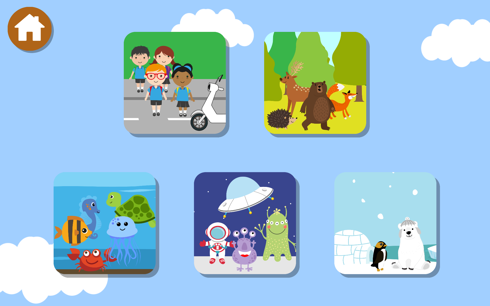
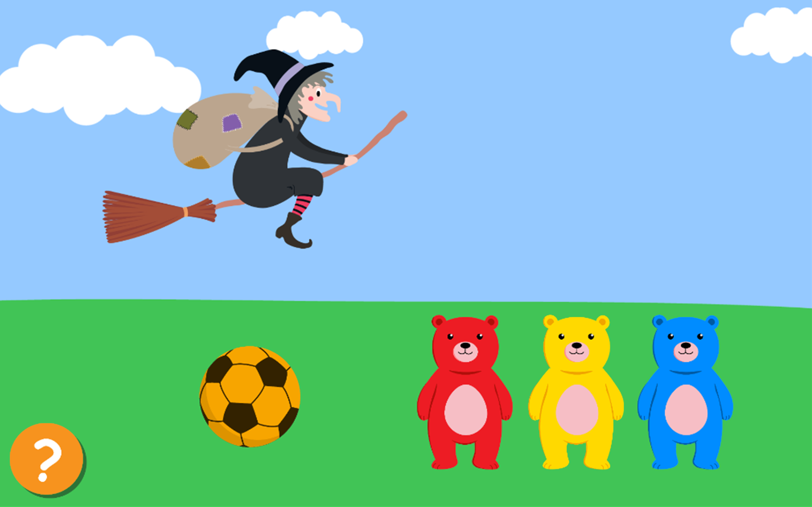
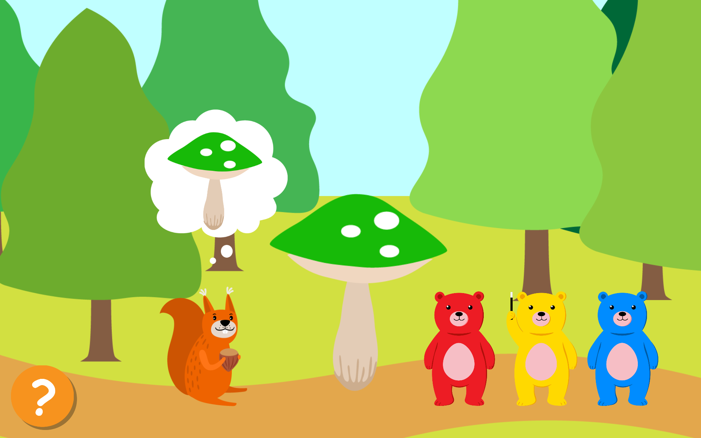
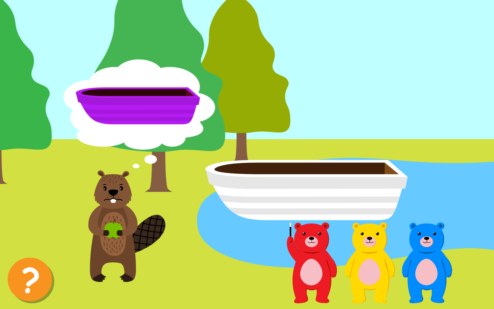
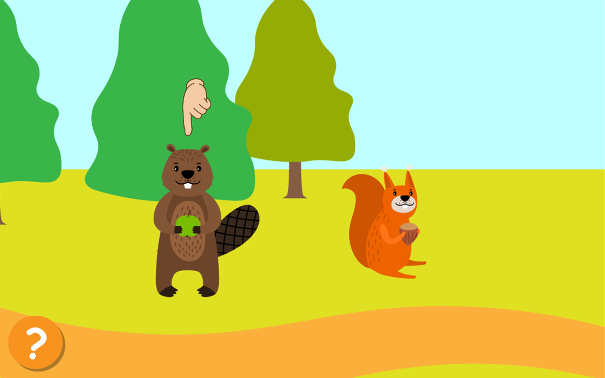
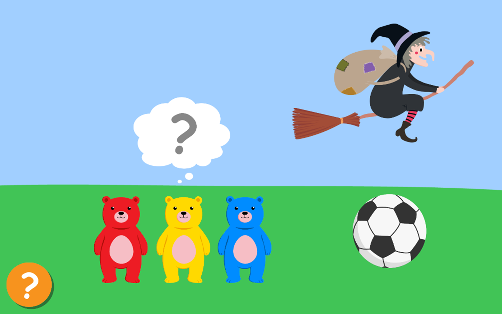
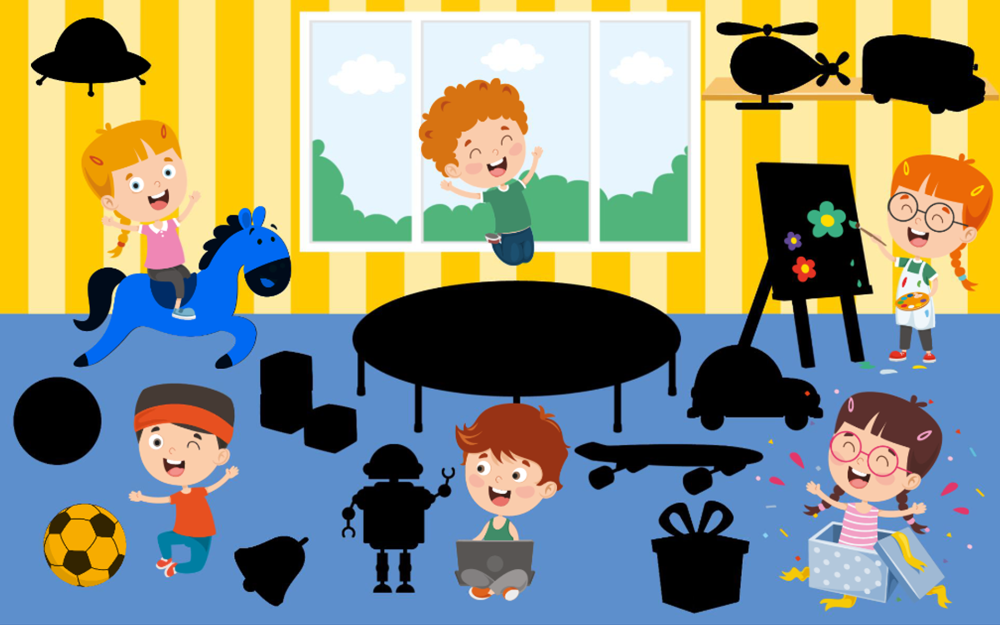

# ColorMemo

## Description

*ColorMemo* was developed as a part of the bachelor's thesis on "Graphic Design for Improving Children's Visual Memory". The game's aim is to offer a collaborative approach to help children improve their visual memory.

## Requirements

*ColorMemo* was developed to be played in combination with a TUI that has three pens.
Therefore, the following is required:

* **Web Server** running the files in folder  **TUI-communication**
* **TUI**
* A **URL.txt** file containing the string *[IP Adress of web server]/GetColor.php* located in the Application.persistentDataPath. Example:
  * Path to URL.txt file: *C:\Users\\[UserName]\AppData\LocalLow\DefaultCompany\colormemo\URL.txt*
  * File contains the string: *192.168.178.21/GetColor.php*

The app does not have a responsive design. The target device is a tablet device with a resolution of 1920 x 1200 px.

## How to Play

1. Choose 3 players or 1 player mode
   * Add new player names if needed
   * Drag and drop player names into color slots
2. Select a theme
   
3. Solve the given tasks (more details in [next section](#structure) )

## Game Structure & Memory Tasks

1. Part 1: Witch steals an object
   * Memorise the stolen object's color
   

1. Part 2: Color (mixing) tasks
   * Inital level count: 2
   * Color the objects with the given color
   * Memorise the order of appearing characters
      

      
      
      

1. Part 3: Order task (Visual sequential memory)
   * Recall the order of the displayed characters
   
  
2. Part 4: Witch returns object (Visual form constancy memory)
   * Recall the stolen object's color
   
   * If correct
     * The stolen objects is added to the reward collection
   
     * Number of levels will be increased by 1
   * If wrong:
     * The stolen object stays the same
     * Number of levels stays the same

## Reward Collection

* The current reward collection can be viewed from the menu screen.
* It displays a png file showing all the collected objects

## Coloring Pictures

* Access through button on the top left corner on the menu screen.
* All colored pictures will be displayed in a scroll view. They can be colored again simply by clicking on the desired coloring picture. The most recent coloring will be displayed.

## Notes

* The start screen appearing right after starting the application displays a button **Delete game files** in the bottom right corner to remove all game files (such as reward pictures, player data, etc.)
